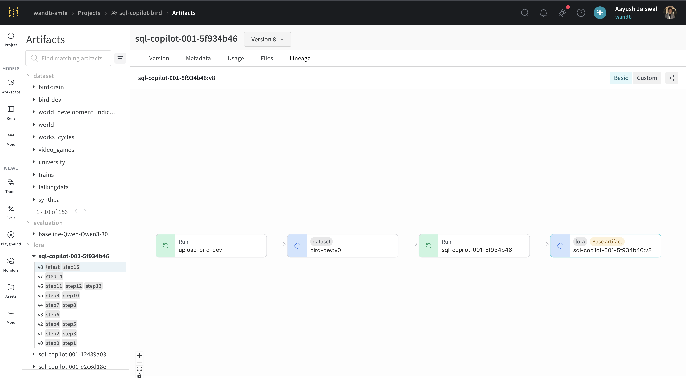
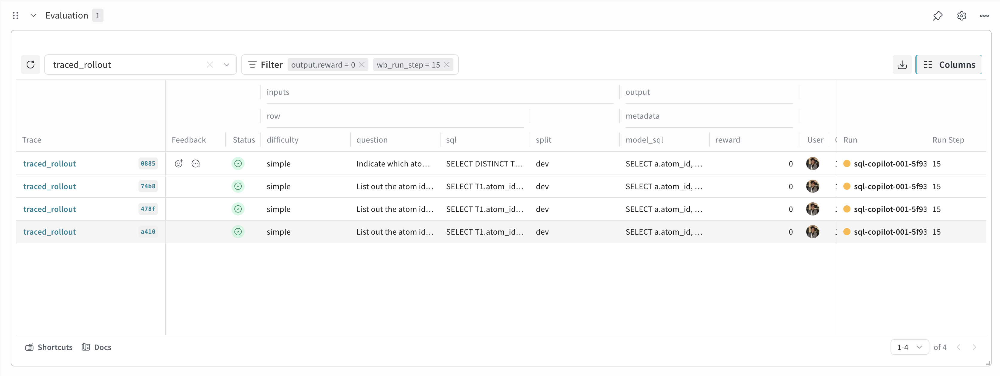
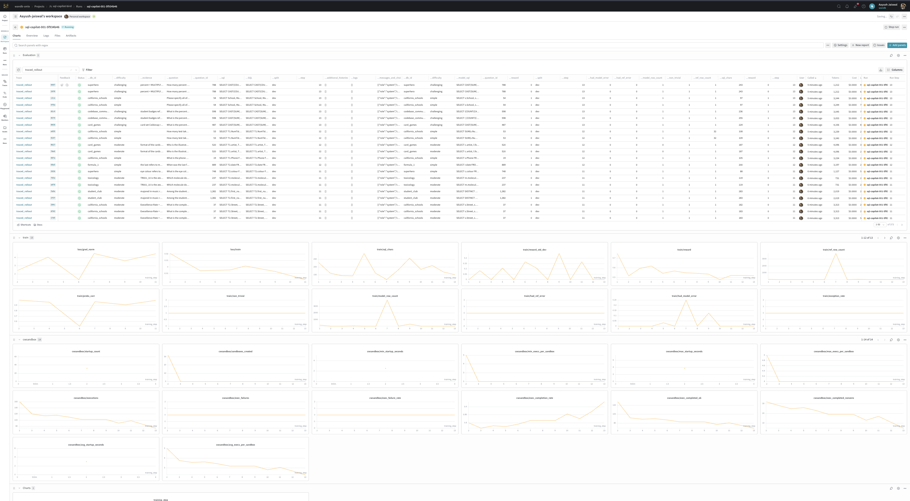
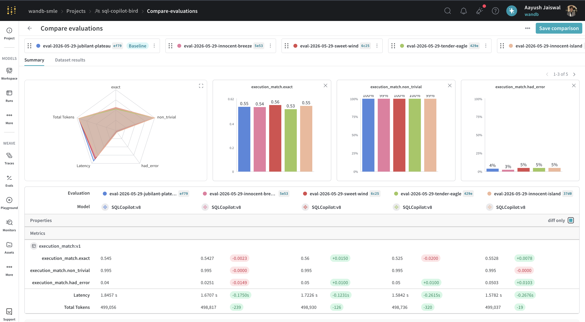

# Serverless RL on BIRD-SQL

This is the story behind the repo: an **entire RL finetuning workflow that runs
without a single piece of infrastructure you have to stand up yourself.** No GPU
cluster, no inference server, no database host, no CI box. Every heavy
component: GPU training, policy inference, and the execution-based reward, runs
on **CoreWeave GPUs, served through Weights & Biases**: Serverless RL for the
training loop, W&B Inference for generation, and Serverless Sandboxes for execution.
Your laptop (or a W&B serverless sandbox) just orchestrates.

We use SQL as the worked example because it makes the reward unambiguous, but the
point is the stack: this is what a fully serverless post-training workflow looks
like end to end. The arc runs dataset → W&B Registry → reward function → first rollouts in
Weave → training curve in W&B → held-out curve climbing → final drill-down.

For the clone-and-run quickstart, see [`README.md`](../README.md).

---

## 1. The setup, in one paragraph

Every data-driven company has a "SQL copilot" project on the roadmap. The honest version of that project is: can a model take a question in English and a messy 30-table schema, and write SQL that *runs and returns the right rows*? Not SQL that compiles. Not SQL that looks correct. SQL that, when executed against the real database, returns the same result set as the analyst's gold query. That is the only definition of correctness an end user cares about.

That's exactly what BIRD-SQL measures: 12,751 questions across 95 real-world SQLite databases —> healthcare, finance, education, sports; paired with gold SQL and a "did it execute to the same answer" scoring rule. BIRD-dev sits around 65-70% for frontier models. Plenty of headroom.

## 2. Why this is a perfect RL workload

Most RL post-training projects fight the same boss: building a non-cheatable reward function. LLM judges drift. Reward models miss-rank. Heuristics overfit. **SQL doesn't have this problem.** The reward is *the result set comparison*. Two queries, run them both, did they return the same rows? Done. Reward ∈ {0, 1}.

The catch: you need somewhere safe to actually *run* arbitrary model-generated SQL against arbitrary databases, thousands of times per training step. That's the sandbox.

## 3. Architecture in one diagram

```
       ┌────────────────── train_serverless.py ──────────────────┐
       │                                                          │
       │   for each step:                                         │
       │     sample N prompts from BIRD-train                     │
       │     for each prompt: K rollouts                          │
       │                                                          │
       │     each rollout:                                        │
       │       ─▶ Serverless RL endpoint generates SQL            │
       │       ─▶ wandb Sandbox runs model SQL + ref SQL          │
       │       ─▶ multiset-compare → reward ∈ {0, 1}              │
       │       ─▶ Weave records the whole rollout as a trace      │
       │                                                          │
       │     backend.train(model, groups)  ── GRPO step           │
       │                                                          │
       │     every 25 steps:                                      │
       │       run held-out Weave Evaluation over dev-200         │
       └──────────────────────────────────────────────────────────┘
```

The thing to notice: **every box in that loop runs on managed CoreWeave/W&B
infra.** Nothing here provisions a node or boots a server.

| In a normal RL setup you'd run… | Here it's served by… |
|---|---|
| A GPU training cluster + the GRPO optimizer | **Serverless RL** (ART `ServerlessBackend`) on CoreWeave |
| A vLLM / TGI inference server for rollouts | **W&B Inference**, the same endpoint auto-updates to each new checkpoint |
| A sandbox VM or DB host to execute SQL safely | **W&B Serverless Sandboxes**, warm-pooled for the run |
| An artifact store + dataset versioning for the BIRD DBs | **W&B Registry**, one aggregated artifact per split, pulled per-DB on demand |
| Experiment tracking + trace storage + eval infra | **W&B + Weave**, no collector to host |

The orchestrator loop itself is a few hundred lines of Python; with
`scripts/run_in_sandbox.py` even *that* runs in a sandbox, so the entire
workflow can execute with nothing on your own hardware.

And because the dataset enters each run through the **Registry**, the whole chain is captured as lineage automatically: the `upload-bird-*` run produces the dataset artifact, the training run declares it as an input, and every step emits a versioned LoRA checkpoint. All of it is walkable in the Artifacts graph.


*Lineage for one run: `upload-bird-dev` → the `bird-dev:v0` dataset artifact → the `sql-copilot-001-…` training run → its LoRA checkpoint `:v8`. The left rail lists each split as a Registry collection and every step's checkpoint version (`step1 … step15`).*

## 4. The reward function, in 60 seconds

Open `src/reward.py`. The whole reward is one `@weave.op` named `score_sql`.

```python
@weave.op
async def score_sql(model_sql, ref_sql, db_id, split="train"):
    # 1. Borrow a warm sandbox from the pool
    # 2. Drop both SQL strings into /tmp/q_*.sql
    # 3. Invoke the in-sandbox helper (sqlite3 + JSON stdout)
    # 4. Multiset-compare the two row lists
    # 5. Return {reward: 0|1, model_rows, ref_rows, ...}
```

Two design choices worth flagging:

- **Lazy per-DB pulls from the Registry** — the full split is one multi-GB artifact, so we never download the whole thing. The first time a sandbox sees a given `db_id`, an in-sandbox puller fetches just that one entry (`Artifact.get_entry(name).download(...)`) and caches it on that sandbox's filesystem; later rollouts on the same DB skip the download.
- **`SandboxPool(size=12)`** — sandbox cold start is 5–15 seconds. At 32 rollouts/step × 500 steps we'd otherwise burn months in cold starts alone. A small pool of long-lived sandboxes amortises that cost over the run.

## 5. First rollouts in the Weave Traces UI

Open the `traced_rollout` table in Weave. Each row is one trajectory, and the columns line the inputs up against the outcome:

- `difficulty` — `simple` / `moderate` / `challenging`
- `question` — the natural-language ask
- `sql` (the gold query) next to `model_sql` (what the policy wrote)
- `split` — `dev` / `train`
- `output.reward` — 0 or 1
- `Run` / `Run Step` — which checkpoint and training step produced the row

Drop two filter chips: `output.reward = 0` and `wb_run_step = 15`, and you're staring at exactly what the model gets wrong. Expand any row and you get the full picture:

- The exact user message we showed the model (schema + question)
- The completion (in full, including any explanation it tried to add despite our system prompt)
- The extracted SQL
- A nested `score_sql` op with both result sets side by side
- The reference SQL's result set, for contrast

This is the part that's hard to do without Weave: Slicing by `difficulty` and `Run Step` turns the failure modes into something you can reason about.


*The `traced_rollout` table filtered to `output.reward = 0` and `wb_run_step = 15`: every step-15 failure with its `question`, gold `sql`, and the model's `model_sql` side by side.*

## 6. Training health in the W&B Workspace

Open the W&B run. Because the orchestrator installs `wandb.run` for ART, three families of panels populate on the shared `training_step` axis with nothing to wire up:

- **`train/*`** —> training metrics like `reward_mean`, `loss`, `kl`, `completion_length` get automatically logged. 
- **`cwsandbox/*`** —> fleet health for the execution sandboxes, logged straight from the Serverless Sandboxes reporter (boot counts, exec latency, lifetimes). You get execution-infra observability for free.
- **Eval panels** —> the held-out `execution_match` curve from the periodic dev-200 passes, plus the rollout Weave panel up top.


*One workspace: the per-rollout table up top, then the auto-logged `train/*`, `cwsandbox/*`, metrics.*

## 7. Held-out scoring in the Weave Evals tab

Every few steps we re-run the same 200-row BIRD-dev subset against the checkpoint that step auto-deployed to W&B Inference. Each pass is its own evaluation, all bound to the same `SQLCopilot` model lineage.

Comparison is what this UI is for. Pick a baseline pass and any later passes, and Weave lays them side by side:

- A **radar** across every scorer metric: `exact`, `non_trivial`, `had_error`, plus `Latency` and `Total Tokens`.
- **Per-metric bars**: `execution_match.exact`, `execution_match.non_trivial`, `execution_match.had_error` so you see at a glance which passes moved.
- A **metrics table**: with each eval's value and a color-coded delta vs. the baseline: a `+0.0150` on `exact` or a `−0.26s` on latency jumps out immediately.

For the "what is the model actually learning" story, switch to the **Dataset results** tab and drill into the rows that flipped 0↔1.


*Compare evaluations: a baseline pass against four later ones, with the `execution_match` scorer (`exact` / `non_trivial` / `had_error`), latency, and token counts shown as a radar, per-metric bars, and a delta table.*

## 8. Reproducing this

Everything is in the repo, and the headline path needs **zero infrastructure of your own**: `python -m src.train_serverless` drives the whole loop against Serverless RL, W&B Inference, and Sandboxes (preview access required). 

That's the takeaway: an end-to-end RL finetune: training, inference, execution rewards, eval, and tracing running entirely on CoreWeave through Weights & Biases, with nothing to provision.

See [`README.md`](../README.md) for the quickstart.
